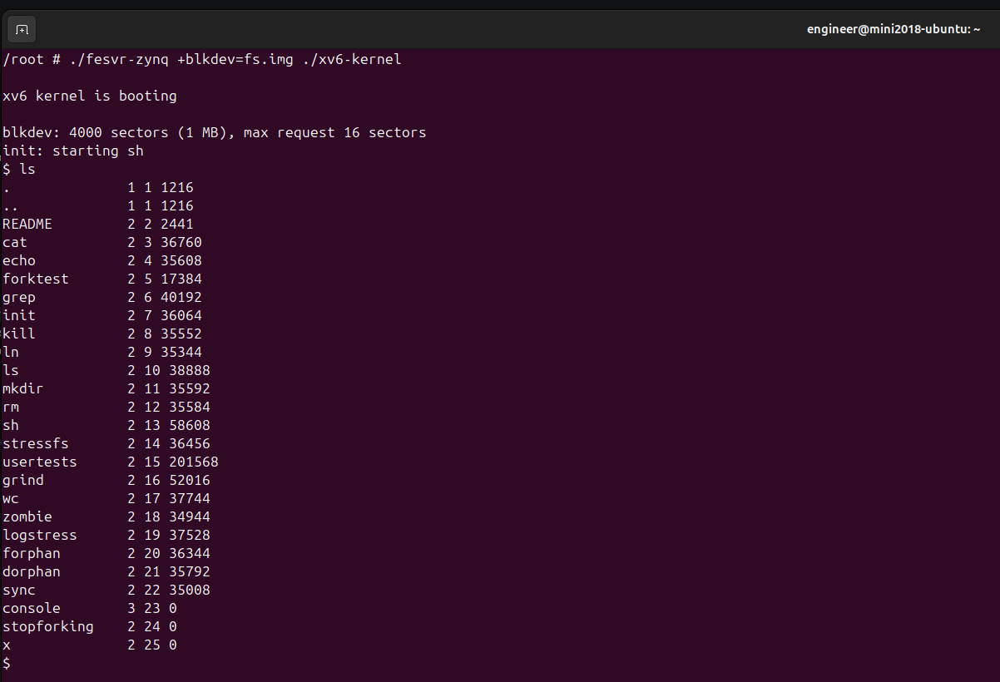

# MIT xv6 on a UCB Rocket Chip, on a PYNQ-Z1

Running **MIT's [xv6-riscv](https://github.com/mit-pdos/xv6-riscv)** on a
**UC Berkeley [Rocket Chip](https://github.com/chipsalliance/rocket-chip)**
RV64GC core synthesized into the FPGA fabric of a Digilent/TUL **PYNQ-Z1**
(Zynq-7020, `xc7z020clg400-1`) — built with **Vivado 2024.1** and a modern
GCC 13 host toolchain.

The upstream starting point, [`ucb-bar/fpga-zynq`](https://github.com/ucb-bar/fpga-zynq),
is deprecated, targets Vivado 2016.2, and has no PYNQ-Z1 board port. This repo
holds the board port, the fixes needed to make an 8-year-old build system produce
a working boot chain on current tools, and the xv6 port itself.

**Status:** working end to end. Linux boots to an interactive shell; the Rocket
Chip core in the PL runs RISC-V programs driven from that shell; and **xv6 runs
on Rocket with an interactive shell of its own**, off its own disk. The full
upstream **`usertests` suite passes on the hardware** — all 64 tests, including
the slow ones (see [`xv6/`](xv6/)).

```
BootROM → FSBL → u-boot 2014.07 → Linux 3.15 → busybox → ~ #
                                                          └─ fesvr-zynq → Rocket (RV64) → xv6 → $
```



*On real hardware: `fesvr-zynq` launched from the ARM shell, xv6 booting on the
Rocket core in the PL, and `ls` listing its own filesystem.*

```
~ # cd /root && ./fesvr-zynq ./hello.riscv
Hello from Rocket Chip on PYNQ-Z1!
sum(1..100) = 5050 (expected 5050)
64-bit shift OK (1<<40)
PASS
```

---

## How it fits together

The Zynq-7020 is two processors in one package, and this project uses both.

```
┌─ PS: hard silicon ───────────────┐   ┌─ PL: FPGA fabric ──────────┐
│  ARM Cortex-A9 dual-core         │   │  Rocket Chip RV64GC        │
│  Linux 3.15 + busybox            │   │  ZynqFPGAConfig, 25 MHz    │
│                                  │   │                            │
│  fesvr-zynq  ──── TSI / HTIF ────┼───┼──►  xv6                    │
└──────────────────────────────────┘   └────────────────────────────┘
         AXI HP0 ──► shared DDR ◄── Rocket 0x8xxxxxxx = Zynq 0x1xxxxxxx
```

**xv6 does not own the board.** It runs on the soft RISC-V core in the fabric,
while the hard ARM core beside it runs Linux and acts as xv6's front-end server.
`fesvr-zynq` loads the RV64 ELF into Rocket's DRAM over the TSI serial link,
releases the core from reset, and then services everything xv6 cannot do for
itself:

- **Console.** This Rocket configuration has *no UART at all*. xv6's output is
  HTIF messages that fesvr turns into writes on the ARM console, and its input is
  characters fesvr hands back the same way. That is why the port replaces
  `uart.c` with [`xv6/htif.c`](xv6/htif.c).
- **Disk.** `+blkdev=fs.img` is an ordinary file on the ARM side. testchipip's
  DMA engine in the fabric pulls blocks across the same link, so
  [`xv6/blkdev.c`](xv6/blkdev.c) replaces `virtio_disk.c`.

So the ARM Linux bring-up is not a detour: without a working shell on the PS
there is nothing to launch `fesvr-zynq`, and therefore no way to run anything on
Rocket at all. The four bugs below were all in service of getting that far.

One consequence to keep in mind: **the two processors share the same physical
DRAM.** `rocketchip_wrapper.v` maps Rocket's `0x8xxxxxxx` onto Zynq DDR
`0x1xxxxxxx`, so Linux has to be confined to the low 256MB or a program running
on Rocket writes straight over the running ARM kernel — see
[the memory split](#the-armrocket-memory-split).

> Note on the name: upstream `fpga-zynq`'s own goal was booting *Linux on Rocket*.
> That is **not** what this does. Linux here runs on the ARM core; the RISC-V core
> runs xv6.

---

## The four bugs

Every one of these presented as "no output" or "garbage on the console", and
none of them were in code we wrote. They're recorded here in detail because the
symptoms are badly misleading and the root causes are all latent bugs in the
standard Xilinx/newlib/upstream combination rather than anything specific to
this design.

### 1. FSBL crashed before printing a single byte

**Symptom:** completely silent boot. JTAG showed the CPU spinning in
`Xil_DataAbortHandler` at a fixed address, on every power cycle, with a
Data Fault Status Register value that decodes to *asynchronous external abort*
and `DFAR = 0x00000000` — which reads exactly like a null-pointer write and
sent the investigation in the wrong direction for a long time. (For
*asynchronous* aborts the ARM spec says `DFAR` is UNPREDICTABLE; the zero was
meaningless.)

**What it actually was:** single-stepping the C runtime startup showed the
fault hit on the **first stack push inside `memset()`** while zeroing BSS.
Xilinx's `boot.S` correctly programs every CPU-mode stack pointer from the
linker script, all inside the one 64 KB OCM bank that `OCM_CFG` maps to the
high address alias (`0xFFFF0000–0xFFFFFFFF`, `OCM_CFG = 0x18` by default).
Then newlib's generic **weak `_stack_init()`**, called later from
`_mainCRTStartup`, recomputes all of those stack pointers with hardcoded
byte-offset arithmetic (`sp - 4096 - 4096 - 4096 - 8192 - 32768`, masked) that
knows nothing about `OCM_CFG`. Starting from `0xFFFF6000` that lands on
`0xFFFE0000` — an OCM bank *not* mapped at the high alias. The first write
there is a real external bus error.

Xilinx's FSBL template never provides a strong `_stack_init` to override
newlib's, so the bug is latent in the standard BSP + modern toolchain pairing.

**Fix:** [`fsbl/stack_init_override.c`](fsbl/stack_init_override.c) — a no-op
strong `_stack_init()` so `boot.S`'s correct setup survives.

Ruled out along the way (all innocent): the custom block design and HP0 port,
the PS7 register configuration, the MMU translation table, the L2 cache
controller (PL310), the SCU, and Cortex-A9 errata 742230/743622 (the silicon
is r3p0, `MIDR = 0x413fc090`, which doesn't need them).

### 2 & 3. Garbled console — the same bug in two codebases

PYNQ-Z1's PS reference oscillator is **50 MHz**
(`PCW_CRYSTAL_PERIPHERAL_FREQMHZ = 50` in the board preset). Zedboard/ZC702 use
33.333 MHz, and both u-boot and the kernel hardcode that value as a default.

`ps7_init()` programs the PLLs correctly from the real hardware, so the clocks
*are* right — but both codebases recompute every derived rate, including the
UART baud divisor, **in software** from their compile-time constant. Wrong
constant → wrong divisor → unreadable console, while everything else keeps
running fine.

- **u-boot:** `CONFIG_ZYNQ_PS_CLK_FREQ` defaults to `33333333` in
  `arch/arm/cpu/armv7/zynq/clk.c` and was never overridden.
  Fixed in [`board/soft_config/zynq_pynqz1.h`](board/soft_config/zynq_pynqz1.h).
- **kernel:** `zynq-7000.dtsi` hardcodes `ps-clk-frequency = <33333333>`.
  Overridden in [`board/soft_config/pynqz1_devicetree.dts`](board/soft_config/pynqz1_devicetree.dts).

### 4. Kernel panic, then a shell respawn loop

Two small userspace issues, back to back:

- **`Unable to mount root fs on unknown-block(1,0)`** — the initramfs unpacked
  fine, but our busybox rootfs has `/sbin/init` and `/linuxrc`, no `/init`.
  The kernel looks for `/init` specifically, doesn't find it, silently falls
  back to mounting `root=` as a block device, and panics.
  Fixed with `rdinit=/sbin/init` in the devicetree `bootargs`.
- **`can't open /dev/ttyPS0: No such file or directory`**, repeating forever —
  `CONFIG_DEVTMPFS_MOUNT` only auto-mounts `/dev` when the kernel mounts a
  *real* root filesystem; it deliberately skips initramfs. `/dev` stayed empty,
  so inittab's getty died in a respawn loop.
  Fixed with `mount -t devtmpfs devtmpfs /dev` in
  [`rootfs/etc/init.d/rcS`](rootfs/etc/init.d/rcS).

Two more of the same character turned up on the RISC-V side — a block-device DMA
that silently drops the tail of any transfer to a destination that is not
64-byte aligned, and a whole class of exceptions that rocket-chip refuses to
delegate, which upstream xv6 then mistakes for timer interrupts and retries
forever. Both are written up in [`xv6/README.md`](xv6/README.md).

---

## Layout

```
board/
  Makefile                     BOARD=pynqz1, xc7z020clg400-1, ZynqFPGAConfig
  ps7_init.tcl                 PS7 init sequence (also usable from xsct for JTAG debug)
  src/tcl/pynqz1_bd.tcl        block design; board preset instead of a Zedboard PS7 dump
  src/tcl/*.tcl                project + bitstream generation
  src/constrs/base.xdc         125 MHz clock on pin H16
  src/verilog/clocking.vh      MMCM for 125 MHz in / 25 MHz Rocket clock
  src/verilog/rocketchip_wrapper.v
  soft_config/zynq_pynqz1.h    u-boot board config (UART0, 512 MB, 50 MHz PS clk)
  soft_config/pynqz1_devicetree.dts
fsbl/
  stack_init_override.c        bug #1 fix
  main.c                       FSBL main with an explicit UART0 CR write
rootfs/etc/                    inittab + rcS (bug #4 fix)
board/uEnv.txt                 u-boot ramdisk placement (see memory split below)
xv6/                           xv6-riscv port: HTIF console, CLINT timer, PTE A/D,
                               testchipip disk, M-mode trap reflection
riscv-test/                    minimal RV64 HTIF test program for the Rocket core
tools/pl-probe.c               dumps the Zynq adapter regs to check the PS->PL link
tools/send-kernel.py           push a rebuilt RV64 kernel to the board over serial
patches/
  u-boot-xlnx/                 modern-toolchain fixes + board config
  linux-xlnx/                  modern-toolchain fixes
docs/JTAG-DEBUGGING.md         the methodology that found bug #1
```

Vivado build output, generated Verilog, busybox binaries and the packaged boot
images are **not** tracked — see `.gitignore`.

---

## Board differences vs Zedboard

| | Zedboard | PYNQ-Z1 |
|---|---|---|
| Part | `xc7z020clg484-1` | `xc7z020clg400-1` |
| Console UART | UART1 | **UART0** (MIO 14/15) |
| DDR | 256 MB | **512 MB** |
| PS ref clock | 33.333 MHz | **50 MHz** |
| PL clock in | 100 MHz | **125 MHz** (pin H16) |
| Rocket clock | 25 MHz | **40 MHz** (see `clocking.vh`) |

---

## Building

Prerequisites: Vivado 2024.1, `arm-none-eabi-gcc` (FSBL), `arm-linux-gnueabihf-gcc`
(u-boot/kernel), the PYNQ-Z1 board files, and a `fpga-zynq` checkout with its
submodules.

Because the upstream sources predate GCC 5, both builds need extra flags. The
patches under `patches/` cover the source-level fixes; these are the build
invocations:

```bash
# u-boot
make ARCH=arm CROSS_COMPILE=arm-linux-gnueabihf- zynq_pynqz1_config
make ARCH=arm CROSS_COMPILE=arm-linux-gnueabihf- \
     KCFLAGS="-fcommon -fgnu89-inline" u-boot

# FSBL BSP (the generated top-level Makefile blanks COMPILER_FLAGS, so pass
# EXTRA_COMPILER_FLAGS; its `archive:` rule is also missing $(ARCHIVER))
make -C zynq_fsbl_bsp COMPILER=arm-none-eabi-gcc ARCHIVER=arm-none-eabi-ar \
     EXTRA_COMPILER_FLAGS="-c -mcpu=cortex-a9 -mfpu=vfpv3 -mfloat-abi=hard \
       -Og -g3 -Wall -Wno-attribute-alias -fgnu89-inline"
arm-none-eabi-ar -r ps7_cortexa9_0/lib/libxil.a ps7_cortexa9_0/lib/*.o

# FSBL app  (do NOT pass -nostartfiles: it drops _init/_fini)
make CC=arm-none-eabi-gcc \
     CFLAGS="-Wall -Og -g3 -mcpu=cortex-a9 -mfpu=vfpv3 -mfloat-abi=hard \
             -DFSBL_DEBUG_INFO"

# boot.bin  (Zynq-7000 uses `the_ROM_image:`, not `image:`)
bootgen -image output.bif -w -o boot.bin
```

`FSBL_DEBUG_INFO` matters: without it every `fsbl_printf` is compiled out and
FSBL boots silently even when healthy.

The BSP needs `XPAR_CPU_CORTEXA9_0_CPU_CLK_FREQ_HZ` defined (`108333333`, the
650 MHz CPU 6x clock ÷ 6) in `xparameters_ps.h`; regenerating the BSP wipes it.

### SD card

FAT32, five files at the root:

```
boot.bin  devicetree.dtb  uImage  uramdisk.image.gz  uEnv.txt
```

Boot mode jumper set to SD.

Keep the partition small — 1GB is plenty. Some USB card readers cannot address
past 4GB, and a FAT32 filesystem spanning a whole 32GB card will happily allocate
above that line: the files then read back as the right size with garbage
contents, silently, only when written through that reader. A 1GB partition keeps
everything inside the region such a reader can verify.

---

## Talking to the Rocket core

`fesvr-zynq` runs on the ARM side, loads an RV64 ELF into the Rocket core's
DRAM over the TSI serial link, releases the core from reset, and then services
its HTIF syscalls (so the RISC-V program's `write()` lands on the ARM console).

Two things to know that are easy to get wrong:

- **`fesvr-zynq` does not use UIO.** The devicetree carries a
  `htif@43c00000` node with `compatible = "generic-uio"`, inherited from the
  upstream boards, and on a modern kernel it fails to probe:

  ```
  uio_pdrv_genirq 43c00000.htif: failed to get IRQ
  uio_pdrv_genirq: probe of 43c00000.htif failed with error -22
  ```

  This is a **red herring** — `zynq_driver_t` opens `/dev/mem` and mmaps
  `0x43C00000` directly. The node is vestigial. (The probe failure is itself a
  kernel bug of this vintage: `uio_pdrv_genirq` supports IRQ-less operation but
  only when `platform_get_irq()` returns `-ENXIO`, while for DT devices it
  returns `of_irq_get()`'s `-EINVAL`, so the IRQ-less path is unreachable.)

- **`CONFIG_STRICT_DEVMEM` must be off**, or the `/dev/mem` mapping is refused.

### Checking the link before blaming software

[`tools/pl-probe.c`](tools/pl-probe.c) dumps the adapter's status registers.
On a healthy build, before fesvr runs:

```
  +0x0c  TSI_IN_FIFO_COUNT          = 0x00000010   <- SerialFIFODepth = 16
  +0x10  SYSTEM_RESET               = 0x00000001   <- core held in reset
  +0x34  BLKDEV_RESP_FIFO_COUNT     = 0x00000010   <- BlockDeviceFIFODepth = 16
```

Those depths coming back as exactly the Chisel config values is what
distinguishes a live design from a floating bus. All-`0xffffffff` means the PL
is unconfigured, unclocked, or in reset.

### Test program

[`riscv-test/`](riscv-test/) is a self-contained RV64 bare-metal program — no
riscv-tests or pk needed. It talks HTIF directly: syscalls by writing a request
buffer address to `tohost` and waiting on `fromhost`, exit by writing
`(code << 1) | 1`. It links at `0x80000000` (`ExtMem` base for this config).

```bash
cd riscv-test && make          # -> hello.riscv, needs riscv64-unknown-elf-gcc
# copy hello.riscv to /root in the rootfs, then on the board:
#   cd /root && ./fesvr-zynq ./hello.riscv
```

## The ARM/Rocket memory split

**This matters before running anything non-trivial on Rocket.**
`rocketchip_wrapper.v` wires the Rocket memory port to AXI HP0 like this:

```verilog
assign S_AXI_araddr = {4'd1, mem_araddr[27:0]};
assign S_AXI_awaddr = {4'd1, mem_awaddr[27:0]};
```

So Rocket's `0x80000000–0x8FFFFFFF` **is** Zynq DDR `0x10000000–0x1FFFFFFF` —
the upper half of the PYNQ-Z1's 512MB. It is not separate memory. Three things
have to agree about that:

| Setting | Value | Why |
|---|---|---|
| devicetree `memory` | `reg = <0x0 0x10000000>` | Linux owns only the low 256MB. Give it all 512MB and any Rocket program scribbles over the running ARM kernel — xv6's `kinit()` alone memsets 128MB, which produced slab-allocator Oopses on the ARM side. zedboard does the same (512MB board, `0x10000000` here). |
| `uEnv.txt` `bootm_size` | `0x08000000` | u-boot still sees 512MB and would otherwise place the ramdisk at the top, where Linux cannot reach it. |
| `bootargs` | `cma=16M` | The kernel is built with `CONFIG_CMA_SIZE_MBYTES=128` — fine at 512MB, but half the RAM at 256MB, and the reservation lands on top of the ramdisk. |

The last two interact: at `bootm_size=0x10000000` the ramdisk lands at
`~0x0FBD3000` and collides with the `cma=16M` reservation at `0x0F000000`. The
kernel then dies **before printing anything at all**, which looks alarming but
is just an overlap. `0x08000000` keeps them apart.

## Running it

Power on with the boot mode jumper on SD; the whole chain comes up by itself.

**Do not send anything to the serial port during u-boot's autoboot countdown** —
any keystroke stops it at `zynq-uboot>`. If that happens, type `boot`.

The FTDI presents three ports; the console is the third (`/dev/ttyUSB2` here) at
115200 8N1:

```sh
screen /dev/ttyUSB2 115200
```

(`Ctrl-A K` to quit screen.) Then, on the board:

```sh
# a bare-metal RV64 program on Rocket
cd /root && ./fesvr-zynq ./hello.riscv

# xv6, with a disk
cp /root/fs.img.orig /root/fs.img       # reset the disk to pristine
cd /root && ./fesvr-zynq +blkdev=fs.img ./xv6-kernel
```

Ctrl-C leaves fesvr and returns to the ARM shell. xv6 reaches its `$` prompt in
about 4 seconds.

Resetting the disk between runs matters: xv6 writes to the image, and a crashed
run leaves the log dirty, which shows up as `ireclaim: orphaned inode` or
`panic: freeing free block` on the next boot.

### The rootfs is in RAM

`/root` lives in the initramfs, so **anything written there is gone on reboot**
and the board reverts to whatever is in `uramdisk.image.gz` on the SD card.

While iterating that is a feature — a reboot is a guaranteed clean slate, and it
is the easiest way to restore a damaged `fs.img`. To make a change permanent,
rebuild the ramdisk and rewrite the card.

### Iterating on the RV64 kernel

Because the rootfs is in RAM, a rebuilt kernel can go straight down the console
rather than via the SD card:

```sh
make kernel/kernel                                    # in your xv6 tree
/path/to/tools/send-kernel.py kernel/kernel
```

About 13 seconds to push, 4 to boot. See
[`tools/send-kernel.py`](tools/send-kernel.py) for the several ways this can go
wrong quietly (tty line-buffer limits, flow control, stripping).

---

## Next step

xv6 passes `usertests` in full, so the port itself is in good shape. The obvious
directions from here:

- **Boot Linux on Rocket**, which is what upstream `fpga-zynq` was originally for
  and what this repo's old name wrongly implied. That needs a bigger Rocket
  config than `ZynqFPGAConfig` and a RISC-V Linux build, but the board port,
  bitstream flow and fesvr plumbing underneath are all already working.
- **A larger Rocket config** — more cores, an FPU, or a bigger cache — to see
  what still fits in the xc7z020's fabric.
- **More clock.** 40 MHz ships and closes with 3.4 ns to spare; 50 MHz closes
  at 0.25 ns but is unverified. Getting past ~46 MHz means attacking the
  critical path itself, which runs from the Zynq adapter's address register
  into the TileLink broadcast hub.
- **A bigger Rocket config** — more cores, an FPU, a larger cache — to see what
  still fits in the xc7z020 and how the memory path responds.
